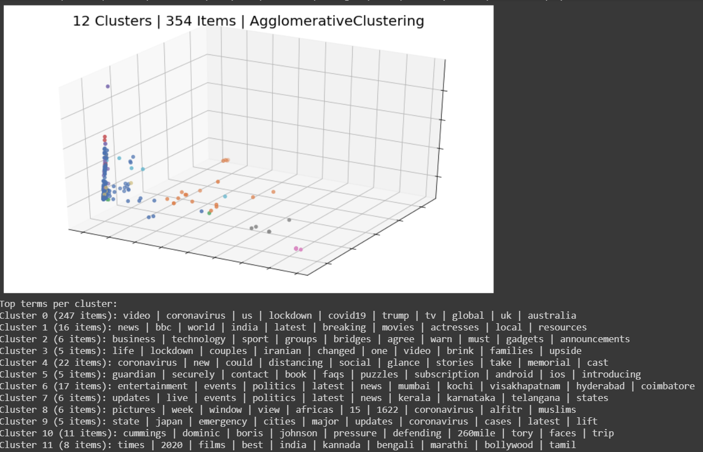
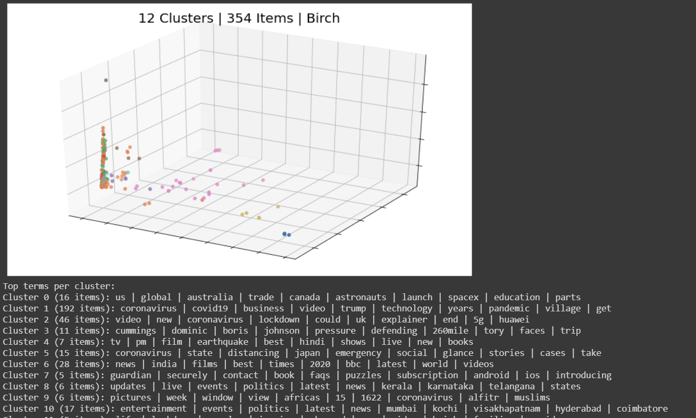
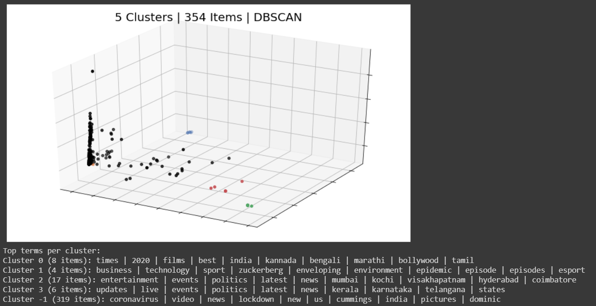
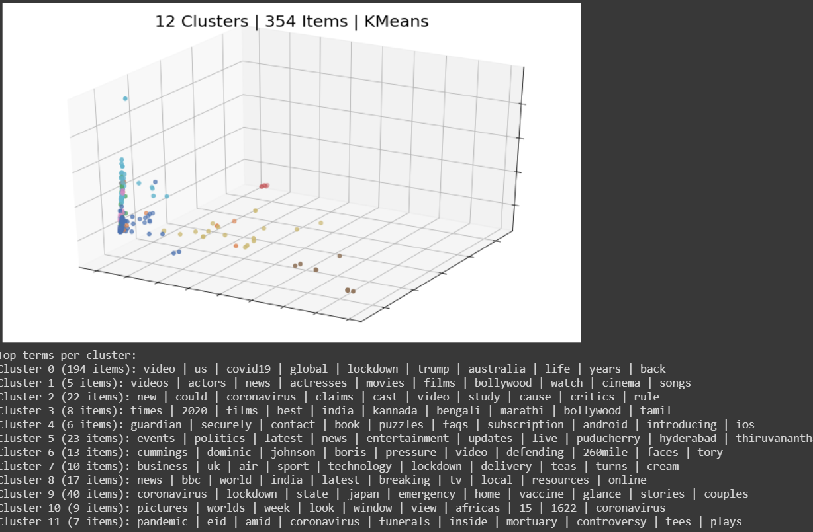
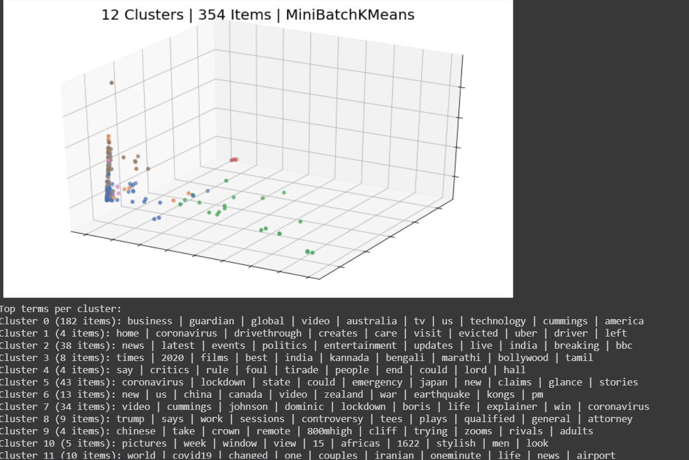
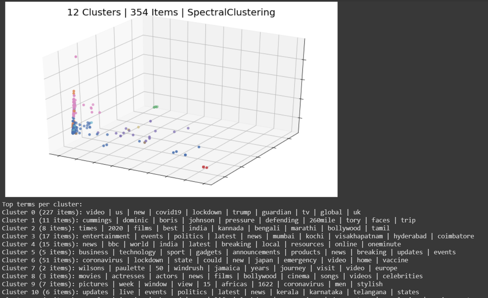

# News Cluster

##### This repository is a clusterer using news headlines

The clustering algorithms used here are MiniBatchKmeans, Agglomerative clustering, Affinity Propogation, Birch clustering, DBSCAN and couple of other algorithms.

#### Execute the IronPythonNoteBook for the best experience

Execute it using Jupiter Notebook or Google Colabs.

Every other python file except the ones named "newscluster" are the starting versions of it. Although "main.py" does result in generation of png files in "results" folder, it has lesser algorithms implemented in it.

Affinity Propogation:

Agglomerative Clustering:

Birch Clustering:

DBSCAN:

KMeans:

MiniBatchKMeans:

Spectral Clustering:
